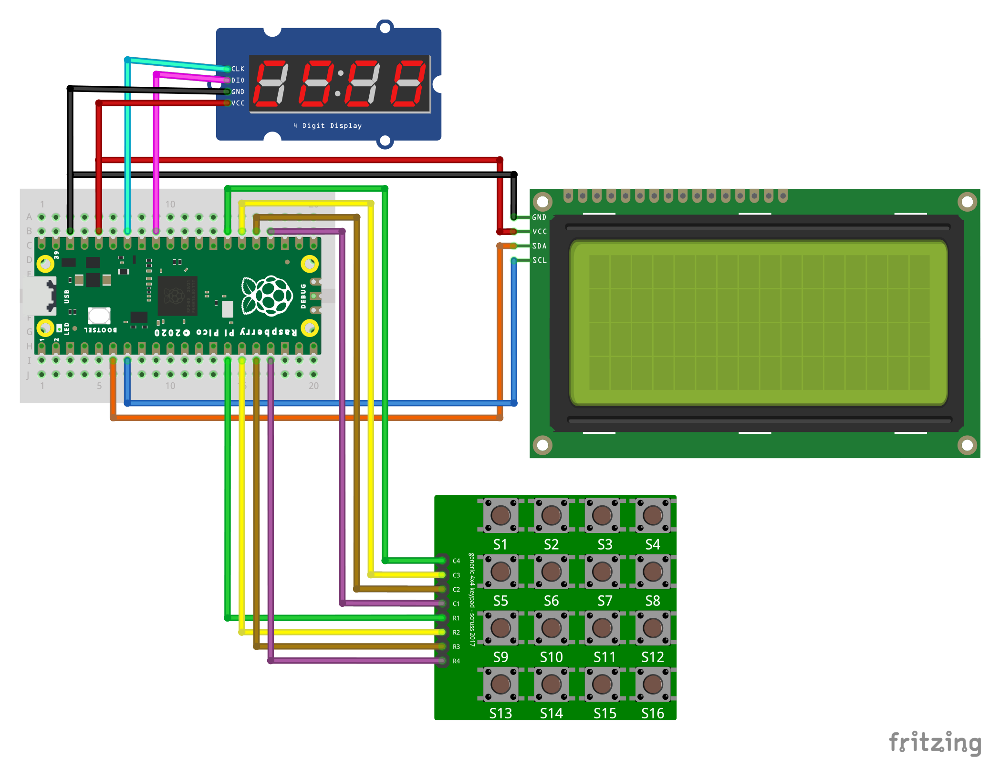

# Raspberry Pi Pico - Tic Tac Toe Game

## Build

After you clone the repo you run the following commands to build the executable. You have to have installed *CMake* and *Make*. Also you need to have the SDK on your system and point `PICO_SDK_PATH` to it.
```sh
export PICO_SDK_PATH='/Path/to/SDK'
```
```sh
cd tic-tac-toe
```
```sh
mkdir build
```
```sh
cd build
```
```sh
cmake ..
```
```sh
make -j4
```
### How to connect the LCD, LEDs and Keypad to the board

